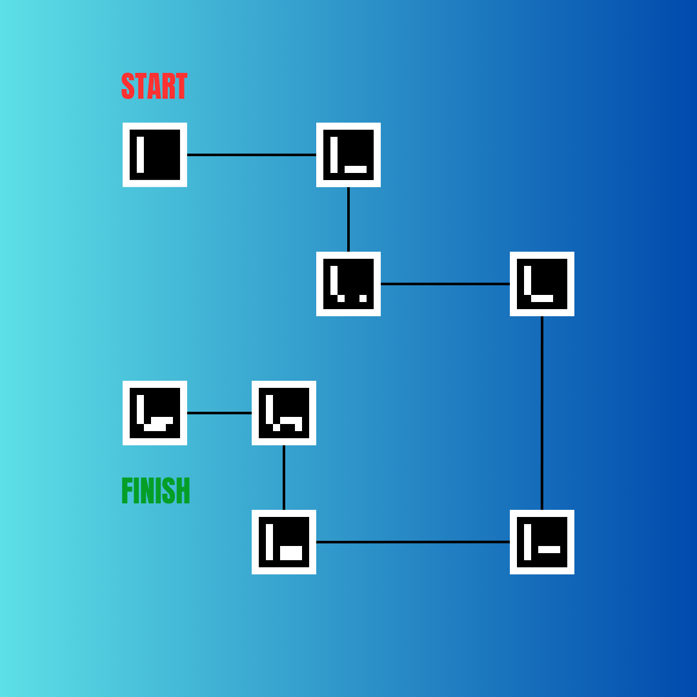
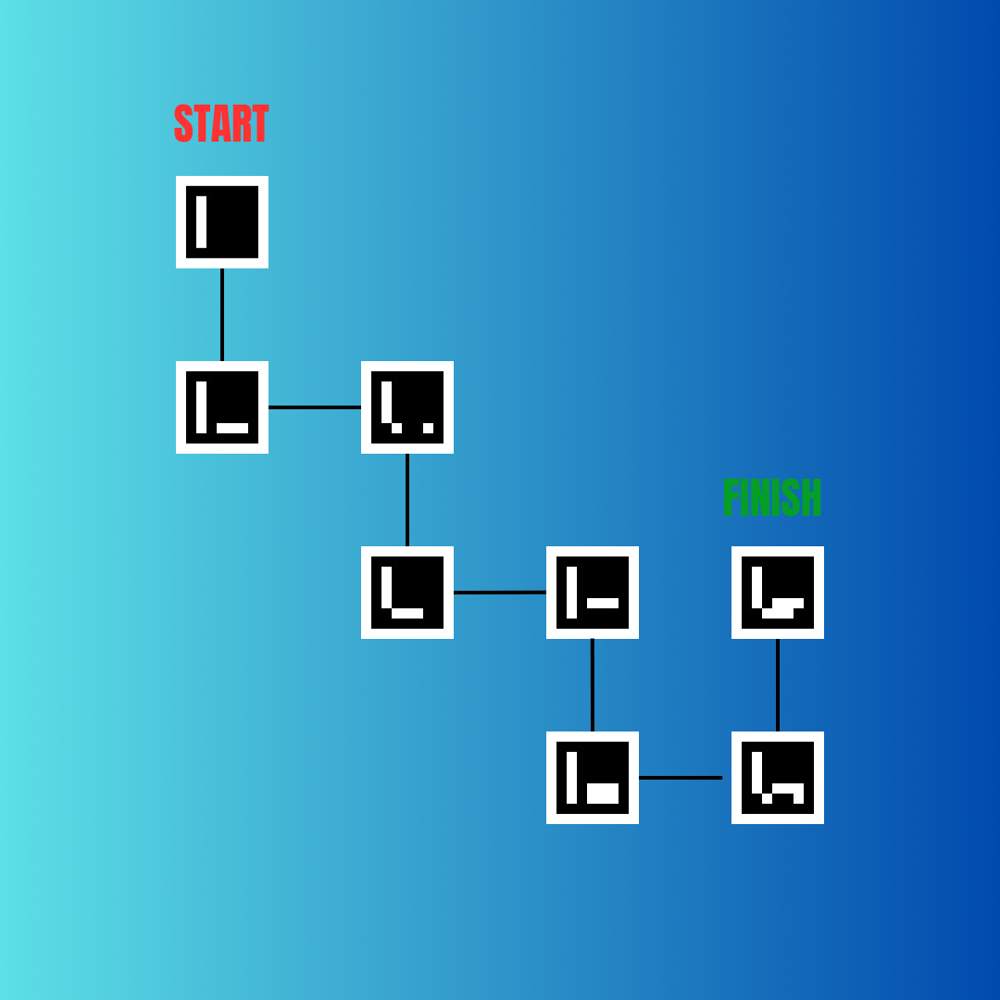

# 🧭 ArUco Marker Path Detection with OpenCV

This project uses **OpenCV's ArUco module** to detect markers in an image, calculate their positions, and determine the directional path between them. It simulates path planning based on the spatial relationship of detected ArUco markers.

---

## 📷 Sample Input Images

<p align="center">
  
  
</p>

### Image 1: Zig-Zag Path with Turns

**Start → Finish:** This image demonstrates a more complex path with left and right turns.

---

### Image 2: Linear Path with Rightward Bias

**Start → Finish:** This image illustrates a more straightforward path layout, with mainly rightward movement.

---

## 💡 How It Works

The code performs the following steps:

1. **Read Image**:
   Load an image using OpenCV from the provided path.

2. **Detect ArUco Markers**:
   Using `cv2.aruco.detectMarkers()` with the `DICT_ARUCO_ORIGINAL` dictionary.

3. **Calculate Center**:
   Compute the average of the 4 corners of each marker to find its center.

4. **Build Path in XY Plane**:
   Determine movement (`+x`, `-x`, `+y`, `-y`) between consecutive marker centers.

5. **Convert to Directional Instructions**:
   Based on movement between points:
   - `F` = Forward
   - `L` = Left
   - `R` = Right
   - `E` = End

---

## 🧪 Example Output

```bash
FRFLFE
```

## 📁 Project Structure
```
.
├── A.png                # First sample path image
├── A1.png               # Second sample path image
├── path_detector.py     # Main Python script
└── README.md            # Project documentation
```

## ⚙️ Requirements

- Python 3.x  
- OpenCV with ArUco support

**Install dependencies:**

```bash
pip install opencv-python opencv-contrib-python
```

## 🧠 Notes

- Ensure markers are placed in the correct order for meaningful path detection.
- You can experiment with different ArUco dictionaries if needed (e.g., DICT_4X4_50).

## 🙌 Acknowledgements
- OpenCV — For computer vision capabilities
- ArUco — For marker detection algorithms

## 📜 License
MIT License — free to use, modify, and distribute.
